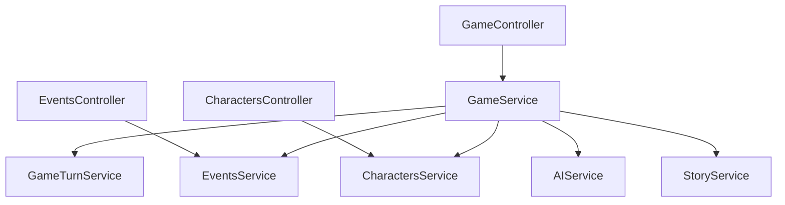

# AI-Powered Turn-Based Game Backend

A nestJS backend designed to orchestrate turn-based gameplay loops driven by external AI service integrations. This project implements clean domain separation, a centralized orchestrator pattern, and defensive error-handling with automatic state rollbacks. Combine with the [Frontend]() for a narrative driven experience.



## Architecture Overview

The application follows a clean modular architecture, separating **HTTP** routing (Controllers) from core workflow orchestration (GameService) and specialized domain micro-services.
```
GameController
    └── GameService (Orchestrator)
    ├── GameTurnService (Turn & State Management)
    ├── EventsService (World, Scene, & Character Events)
    ├── CharactersService (**NPC** Lifecycle & State)
    ├── AIService (AI Content Generation & Parsing)
    └── StoryService (Genre, Tone, & Setting Config)
```

## Learnings
* Async/sync: Async should be used when using a third party api or datasource. The ensure the API that calls the backend API waits for this awaits should be implemented if the caller should wait for the request to be processed, remove this and it becomes an async (fire and forget) endpoint.
* Orchestrator pattern: Using one service to manage the gameplay and the creation of new data, use services to keep track of this state. This way the orchestrator exposes fewer endpoints so it has a clear purpose: End the turn, submit choices. The information in these services is exposed through their own controller layer.
* Mermaid documentation generation: Automatically generated architecture documentation based on the codebase itself.
* Deterministic/generated: Keep things that should happen at intervals, eventrolls, charactercreation rolls in the backend. Let AI fill out the content when an event is created or a character needs to be created. GenAI is not good at doing deterministic rolls since it seems to always have either a high (80%) or low (20%) chance. AI does not do hard math, it seems to stick to extreme values in a spectrum. Rule of thumb: Logic belongs in the backend, content belongs in the GenAI (it is a good replacement for hardcoded events/characters or information that should normally come from the user, if that information is purely content).
* Cohesive prompt sequences: Using a small summary to limit token use but keep enough context for the next prompt so the events follow eachother instead of creating a completely new narrative.
* Circular dependencies: When service A injects Service B, and Service B injects Service A. This is a chicken and egg story, it should be solved architecturally.

## Key Features

* Orchestration Pattern (GameService): Centralizes multi-step transaction loops (such as ending a turn or initializing a new game) without cluttering controllers or domain layers.
* Error Recovery: Gracefully catches AI service failures (timeouts, malformed **JSON** responses) and automatically rolls back game state (debumpTurn) to prevent desynchronization.
* Modular Domain Services: Strictly partitioned domains for tracking game turns, events, characters, and story metadata.
* Testing Suite: Fully tested with Jest unit specs (covering edge cases, mocks, and failure paths) and Supertest **E2E** integration specs.

## Tech Stack

* Framework: NestJS (TypeScript)
* Testing: Jest (Unit), Supertest (E2E)
* Linting: Eslint

# Getting Started

Prerequisites
* Node.js (v18+ recommended)
* npm or yarn
* Installation

## Clone the repository
```
git clone [https://github.com/your-username/your-repo-name.git](https://github.com/your-username/your-repo-name.git)
```
## Install dependencies
```
npm install
```
Running the Application

## development
```
npm run start
```
## watch mode
```
npm run start:dev
```
## production mode
```
npm run start:prod
```
## Running Tests

### unit tests
```
npm run test
```
### e2e tests
```
npm run test:e2e
```
### test coverage
```
npm run test:cov
```