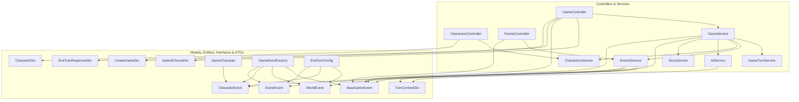

# Full System Architecture

```mermaid
graph TD
    subgraph Core ["Controllers & Services"]
    CharactersController --> CharactersService
    EventsController --> EventsService
    GameController --> GameService
    GameService --> GameTurnService
    GameService --> EventsService
    GameService --> CharactersService
    GameService --> AIService
    GameService --> StoryService
    end
    subgraph Data ["Models, Entities, Interfaces & DTOs"]
    TurnContentDto[TurnContentDto]
    CharacterDto[CharacterDto]
    CharacterEvent[CharacterEvent]
    BaseGameEvent[BaseGameEvent]
    WorldEvent[WorldEvent]
    SceneEvent[SceneEvent]
    SubmitChoiceDto[SubmitChoiceDto]
    CreateGameDto[CreateGameDto]
    EndTurnResponseDto[EndTurnResponseDto]
    AIService --> TurnContentDto
    CharactersController --> CharacterDto
    GameCharacter --> CharacterEvent
    EventsController --> BaseGameEvent
    EventsService --> BaseGameEvent
    EventsService --> WorldEvent
    EventsService --> CharacterEvent
    EventsService --> SceneEvent
    GameEventFactory --> BaseGameEvent
    GameEventFactory --> WorldEvent
    GameEventFactory --> CharacterEvent
    GameEventFactory --> SceneEvent
    GameController --> SubmitChoiceDto
    GameController --> BaseGameEvent
    GameController --> CreateGameDto
    GameController --> EndTurnResponseDto
    GameService --> TurnContentDto
    GameService --> BaseGameEvent
    EndTurnConfig --> WorldEvent
    EndTurnConfig --> CharacterEvent
    EndTurnConfig --> SceneEvent
    end
```
